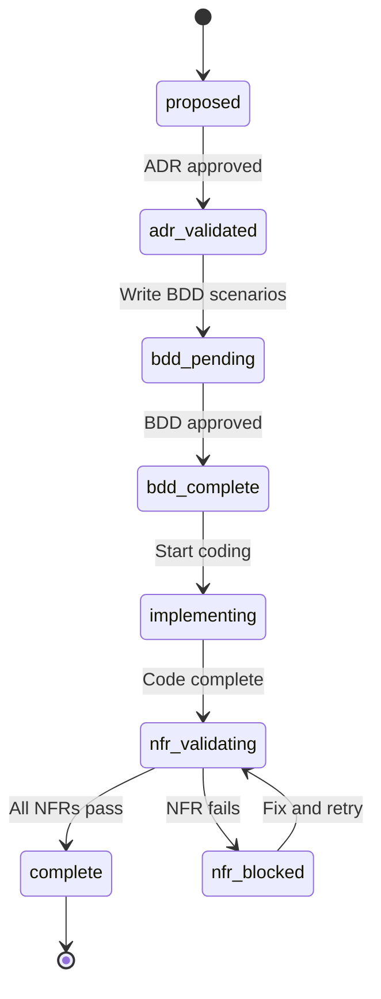

# Documentation Framework Setup Guide

This is a comprehensive documentation framework built on Docusaurus 3.x that supports Domain-Driven Design (DDD), Behavior-Driven Development (BDD), and governance-driven development workflows.

## Table of Contents

- [Overview](#overview)
- [Framework Philosophy](#framework-philosophy)
- [Directory Structure](#directory-structure)
- [Governance Workflow](#governance-workflow)
- [Agent Roles](#agent-roles)
- [Getting Started](#getting-started)
- [Adding a New Feature](#adding-a-new-feature)
- [Validation](#validation)
- [Customization](#customization)
- [Troubleshooting](#troubleshooting)

---

## Overview

This framework provides:

- **Roadmap Tracking** - Track features through an 8-state governance workflow
- **DDD Documentation** - Document bounded contexts, aggregates, domain events
- **BDD Integration** - Link test scenarios to roadmap items
- **ADR Management** - Track architectural decisions
- **NFR Tracking** - Monitor performance, security, accessibility requirements
- **Change History** - Full audit trail with agent signatures
- **Interactive Dashboard** - Kanban, timeline, and dependency views

---

## Framework Philosophy

### Governance-Driven Development

Every feature follows a governance workflow that ensures:

1. **Architecture is validated** before implementation begins
2. **Tests are written** before code (BDD-first)
3. **Quality gates** (NFRs) are checked before completion
4. **All changes are audited** with agent signatures

### Agent-Based Workflow

AI agents handle specific responsibilities:

| Agent | Responsibility |
|-------|---------------|
| `@architecture-inspector` | Validates ADR compliance |
| `@ddd-aligner` | Ensures DDD compliance |
| `@bdd-writer` | Authors BDD scenarios |
| `@bdd-runner` | Executes and validates tests |
| `@code-writer` | Implements features |
| `@ci-runner` | Runs CI/CD checks |
| `@ux-ui-inspector` | Reviews accessibility |

---

## Directory Structure

```
docs/
├── ddd/                    # Domain-Driven Design documentation
│   ├── index.md           # DDD overview
│   ├── domain-overview.md # Project domain description
│   ├── bounded-contexts.md
│   ├── ubiquitous-language.md
│   ├── aggregates-entities.md
│   ├── value-objects.md
│   ├── domain-events.md
│   ├── use-cases.md
│   └── context-map.md
│
├── bdd/                    # Behavior-Driven Development
│   ├── index.md           # BDD overview
│   ├── bdd-overview.md    # Methodology explanation
│   ├── gherkin-syntax.md  # Syntax reference
│   └── feature-index.md   # Feature file listing
│
├── adr/                    # Architecture Decision Records
│   ├── index.md           # ADR overview
│   ├── ADR-TEMPLATE.md    # Template for new ADRs
│   └── ADR-001.md         # Example ADR
│
├── roads/                  # Roadmap Items
│   ├── index.md           # Roadmap overview
│   ├── ROAD-TEMPLATE.md   # Template for new items
│   └── ROAD-001.md        # Example roadmap item
│
├── nfr/                    # Non-Functional Requirements
│   ├── index.md           # NFR overview
│   ├── NFR-TEMPLATE.md    # Template for new NFRs
│   └── NFR-PERF-001.md    # Example performance NFR
│
├── changes/                # Change History
│   ├── index.md           # Change log index
│   ├── TEMPLATE.md        # Template for changes
│   └── CHANGE-001.md      # Example change entry
│
├── plans/                  # Implementation Plans
│   └── index.md
│
├── agents/                 # Agent Documentation
│   └── index.md
│
├── src/
│   ├── components/        # React dashboard components
│   ├── hooks/             # Custom React hooks
│   ├── types/             # TypeScript types
│   └── css/               # Custom styles
│
├── plugins/               # Docusaurus plugins
│   ├── roadmap-data-plugin.js
│   └── bdd-data-plugin.js
│
├── scripts/               # Validation scripts
│   ├── validate-docs.js
│   ├── governance-linter.js
│   ├── validate-changes.js
│   └── validate-bdd-tags.js
│
├── docusaurus.config.ts   # Site configuration
├── sidebars.ts            # Navigation configuration
└── package.json
```

---

## Governance Workflow

### Roadmap Status States

Each roadmap item progresses through 8 states:

```
proposed → adr_validated → bdd_pending → bdd_complete → implementing → nfr_validating → complete
                                                                     ↘ nfr_blocked
```



### State Descriptions

| State | Description | Required Actions |
|-------|-------------|------------------|
| `proposed` | Initial state, requirements being defined | Define requirements |
| `adr_validated` | Architecture decisions approved | @architecture-inspector signs off |
| `bdd_pending` | BDD scenarios written, awaiting approval | @bdd-writer creates scenarios |
| `bdd_complete` | BDD scenarios approved | @bdd-runner validates scenarios |
| `implementing` | Active development | @code-writer implements |
| `nfr_validating` | Validating NFRs | @ci-runner, @ux-ui-inspector check |
| `nfr_blocked` | NFR validation failed | Fix issues |
| `complete` | All checks passed | Create CHANGE entry |

---

## Agent Roles

### @architecture-inspector

**Role**: ADR validation

**Responsibilities**:
- Reviews architecture decisions before implementation
- Validates compliance with existing ADRs
- Signs off on `governance.adrs.validated`

### @ddd-aligner

**Role**: DDD compliance

**Responsibilities**:
- Ensures code follows DDD patterns
- Validates ubiquitous language usage
- Checks bounded context boundaries

### @bdd-writer

**Role**: BDD authoring

**Responsibilities**:
- Writes Gherkin feature files
- Creates test scenarios from requirements
- Links scenarios to roadmap items

### @bdd-runner

**Role**: Test validation

**Responsibilities**:
- Executes BDD tests
- Reports test results
- Signs off on `governance.bdd.status`

### @code-writer

**Role**: Implementation

**Responsibilities**:
- Implements features following TDD
- Follows DDD and hexagonal architecture
- Creates adapters and ports

### @ci-runner

**Role**: CI validation

**Responsibilities**:
- Runs linting and type checks
- Executes test suites
- Validates build process

### @ux-ui-inspector

**Role**: Accessibility review

**Responsibilities**:
- Reviews UI for WCAG compliance
- Checks UX best practices
- Validates responsive design

---

## Getting Started

### Prerequisites

- Node.js 18+ or Bun
- Git

### Installation

```bash
# Clone the repository
git clone <your-repo-url>
cd docs

# Install dependencies (choose one)
bun install
# or
npm install

# Start development server
bun start
# or
npm start
```

The dev server runs at http://localhost:3000

### First Steps

1. **Read the DDD documentation** - Start with `ddd/domain-overview.md`
2. **Review existing ADRs** - Check `adr/` for architectural decisions
3. **Check the roadmap** - See what's planned in `roads/`
4. **Run validation** - Ensure everything passes: `bun run validate`

---

## Adding a New Feature

### Step 1: Create Roadmap Item

1. Copy `roads/ROAD-TEMPLATE.md` to `roads/ROAD-XXX.md`
2. Fill in the frontmatter:

```yaml
---
id: ROAD-001
title: "User Authentication"
status: proposed
phase: 1
priority: high
created: 2026-02-03
governance:
  adrs:
    validated: false
  bdd:
    status: draft
  nfrs:
    applicable: [NFR-SEC-001, NFR-PERF-001]
    status: pending
---
```

3. Add to `sidebars.ts` under the appropriate phase

### Step 2: Get ADR Validation

1. Create any needed ADRs in `adr/`
2. Have `@architecture-inspector` review
3. Update roadmap item:

```yaml
status: adr_validated
governance:
  adrs:
    validated: true
    validated_by: "@architecture-inspector"
    validated_at: "2026-02-03T10:00:00Z"
```

### Step 3: Write BDD Scenarios

1. Have `@bdd-writer` create feature files
2. Link to roadmap item with `@road:ROAD-001` tag
3. Update roadmap item:

```yaml
status: bdd_pending
governance:
  bdd:
    status: draft
```

### Step 4: Get BDD Approval

1. Have `@bdd-runner` review scenarios
2. Update roadmap item:

```yaml
status: bdd_complete
governance:
  bdd:
    status: approved
    approved_by:
      - agent: "@bdd-runner"
        timestamp: "2026-02-03T11:00:00Z"
```

### Step 5: Implement

1. `@code-writer` implements the feature
2. Run tests frequently
3. Update roadmap item:

```yaml
status: implementing
started: 2026-02-03
```

### Step 6: Validate NFRs

1. `@ci-runner` runs CI checks
2. `@ux-ui-inspector` reviews accessibility
3. Update roadmap item:

```yaml
status: nfr_validating
governance:
  nfrs:
    status: validating
```

### Step 7: Complete

1. All NFRs pass
2. Create CHANGE entry in `changes/`
3. Update roadmap item:

```yaml
status: complete
completed: 2026-02-03
governance:
  nfrs:
    status: pass
```

---

## Validation

### Running Validation

```bash
# Quick validation
bun run validate

# Comprehensive CI validation
bun run validate:ci

# Individual validators
node scripts/governance-linter.js --all-roads
node scripts/governance-linter.js --adrs
node scripts/validate-changes.js
node scripts/validate-bdd-tags.js
```

### What Gets Validated

| Validator | Checks |
|-----------|--------|
| `governance-linter.js` | ROAD frontmatter, ADR frontmatter, valid statuses |
| `validate-changes.js` | CHANGE file structure, compliance data, signatures |
| `validate-bdd-tags.js` | Feature file tags, Gherkin structure |

### Pre-build Validation

Validation runs automatically before every build:

```bash
bun run build  # Runs validate first
```

---

## Customization

### Branding

1. **Update `docusaurus.config.ts`:**
   ```typescript
   const config: Config = {
     title: 'Your Project',
     tagline: 'Your tagline',
     url: 'https://your-domain.com',
     organizationName: 'your-org',
     projectName: 'your-project',
   };
   ```

2. **Replace assets:**
   - `static/img/logo.svg` - Your logo
   - `static/img/favicon.ico` - Your favicon

3. **Update `package.json`:**
   ```json
   {
     "name": "your-project-docs"
   }
   ```

### Adding Documentation Sections

1. Create directory: `docs/new-section/`
2. Add `index.md` with frontmatter
3. Update `sidebars.ts`:
   ```typescript
   newSidebar: [
     { type: 'doc', id: 'new-section/index', label: 'Overview' },
   ],
   ```
4. Add to navbar in `docusaurus.config.ts`

### Modifying the Governance Workflow

1. Update `src/types/roadmap.ts` with new statuses
2. Update `plugins/roadmap-data-plugin.js` VALID_STATUSES
3. Update `scripts/governance-linter.js` VALID_ROAD_STATUSES
4. Update templates with new status options

---

## Troubleshooting

### Build Fails with Validation Errors

```bash
# Check what's failing
bun run validate

# Fix the reported issues, then retry
bun run build
```

### Dashboard Not Loading Data

Ensure plugins are enabled in `docusaurus.config.ts`:

```typescript
plugins: [
  './plugins/bdd-data-plugin.js',
  './plugins/roadmap-data-plugin.js',
],
```

### Missing Sidebar Items

1. Check the file has proper frontmatter with `id`
2. Verify the path in `sidebars.ts` matches the file location
3. Ensure file extension is `.md` or `.mdx`

### Gray-matter Parse Errors

YAML frontmatter must be valid:

```yaml
---
id: ROAD-001
title: "Use quotes for strings with special characters"
status: proposed
---
```

Common issues:
- Missing quotes around strings with colons
- Incorrect indentation
- Missing closing `---`

---

## Next Steps

- Read [VALIDATION.md](./VALIDATION.md) for detailed validation documentation
- Check [README.md](./README.md) for quick reference
- Review existing roadmap items in `roads/` for examples
